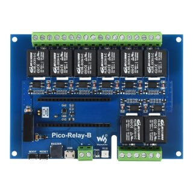
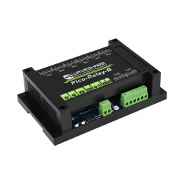

# Waveshare Pico Relay B Controller

A Python library for controlling the Waveshare Pico Relay B board using MicroPython on the board and a Python library for ASCII protocol communication.




## Hardware

- **Board**: Waveshare Pico Relay B (8-channel relay board)
- **MCU**: Raspberry Pi Pico 2 (RP2350)
- **Relays**: 8 channels, 250VAC/10A or 30VDC/10A rating
- **Communication**: USB CDC Serial (Virtual COM Port)

## Features

- Control 8 individual relays with state tracking
- ASCII command protocol for easy integration
- Automatic device discovery via USB
- State persistence with auto-restore on boot
- Buzzer control with tones and alerts
- Relay naming for easy identification
- Watchdog timer for stability
- Heartbeat LED for health monitoring
- Hardware verification tests
- Python library for host communication
- MicroPython firmware for the board

## Quick Start

### 1. Hardware Setup

1. Connect the Waveshare Pico Relay B to your computer via USB
2. Install MicroPython firmware on the Pico 2 (RP2350)
3. Verify hardware connections using the provided test scripts

### 2. Development Environment

```bash
# Clone the repository
git clone <repository-url>
cd picowaveshare

# Set up Python virtual environment
python3 -m venv venv
source venv/bin/activate  # On Windows: venv\Scripts\activate

# Install development dependencies
pip install -e .

# Run tests
make test

# Check code formatting
make lint
```

### 3. Upload Firmware to Pico

The project includes a Makefile for easy firmware deployment:

```bash
# Deploy firmware to the board
make deploy

# Or use mpremote directly:
mpremote connect auto cp micropython/config.py :
mpremote connect auto cp micropython/relay_controller.py :
mpremote connect auto cp micropython/protocol.py :
mpremote connect auto cp micropython/main.py :

# The firmware will start automatically after upload
```

**Note**: The board uses automatic device discovery. If you have multiple devices, specify the port explicitly.

### 4. Hardware Verification

Before using the board, verify the hardware setup:

```bash
# Test all relays
python tests/hardware_verification/test_relays.py

# Test peripherals (LED, buzzer, etc.)
python tests/hardware_verification/test_peripherals.py

# Test USB serial communication
python tests/hardware_verification/test_protocol.py

# Run comprehensive pin verification
python tests/hardware_verification/verify_all_pins.py

# Test the complete protocol (after uploading firmware)
python tests/hardware_verification/test_protocol.py
```

## Firmware Deployment Guide

### Deploying to a New Board

Follow these steps to deploy the relay controller firmware to a new Waveshare Pico Relay B board:

#### 1. Install MicroPython

1. **Enter BOOTSEL mode**:
   - Hold the BOOTSEL button while connecting the board via USB
   - OR press BOOTSEL while pressing the reset button
   - The board will mount as a drive named `RP2040` or `RP2350`

2. **Copy MicroPython firmware**:
   ```bash
   # For RP2040 boards
   cp firmware/micropython-rp2040.uf2 /Volumes/RP2040/
   
   # For RP2350 boards
   cp firmware/micropython-rp2350.uf2 /Volumes/RP2350/
   ```

3. **Wait for reboot**:
   - The board will automatically unmount and reboot
   - It will appear as a serial port (e.g., `/dev/cu.usbmodem*` on macOS)

#### 2. Deploy Relay Controller Code

1. **Find the serial port**:
   ```bash
   # List available ports
   ls /dev/cu.usbmodem*
   ```

2. **Deploy the firmware**:
   ```bash
   # Using the Makefile (auto-detects port)
   make deploy
   
   # Or specify the port explicitly
   PICO_PORT=/dev/cu.usbmodem84401 make deploy
   ```

3. **Reset the board**:
   - The board may need a power cycle or reset after deployment
   - You should hear a beep and see the LED flashing at 2Hz

#### 3. Verify Deployment

```bash
# Test with Python
python -c "
from waveshare_relay import RelayController, find_relay_board
port = find_relay_board()
if port:
    with RelayController(port) as controller:
        print(f'Firmware version: {controller.get_version()}')
        print(f'Board UID: {controller.get_uid()}')
        controller.beep(100)  # Short beep
"

# Or test with the example
python python/examples/basic_control.py
```

### Troubleshooting Deployment

- **Board not detected**: Ensure MicroPython is properly installed and the board has rebooted
- **Import errors**: The board may still be in REPL mode - try power cycling
- **No heartbeat LED**: Check if main.py was deployed correctly
- **Discovery not working**: Verify the board responds to the VERSION command

### Identifying Boards

Each board has a unique ID that can be used to identify it:

```python
from waveshare_relay.discovery import discover_relay_boards

boards = discover_relay_boards()
for board in boards:
    print(f"Port: {board['port']}, Serial: {board['serial_number']}")
```

## Project Structure

```
picowaveshare/
├── docs/                          # Documentation
│   ├── FIRMWARE_SETUP.md         # MicroPython setup guide
│   ├── HARDWARE.md               # Hardware specifications
│   ├── PINOUT.md                 # Pin mappings
│   └── PROTOCOL.md               # Communication protocol
├── micropython/                  # Firmware for the board
│   ├── main.py                   # Main entry point
│   ├── config.py                 # Configuration and constants
│   ├── relay_controller.py       # Hardware control
│   └── protocol.py               # Command parser
├── python/                       # Python library for host
│   └── waveshare_relay/          # Package directory
├── tests/                        # Test suites
│   └── hardware_verification/    # Hardware test scripts
├── Makefile                      # Development tasks
└── pyproject.toml               # Project configuration
```

## Pin Configuration

| Component | Pin | Function |
|-----------|-----|----------|
| Relay 1 | GP21 | Output |
| Relay 2 | GP20 | Output |
| Relay 3 | GP19 | Output |
| Relay 4 | GP18 | Output |
| Relay 5 | GP17 | Output |
| Relay 6 | GP16 | Output |
| Relay 7 | GP15 | Output |
| Relay 8 | GP14 | Output |
| Buzzer | GP6 | PWM Output |
| RGB LED | GP13 | NeoPixel |

## Protocol

The board uses an ASCII-based protocol for communication. Key commands include:

### Relay Control
- `ON <relay_number>` - Turn on relay (1-8)
- `OFF <relay_number>` - Turn off relay (1-8)
- `ALL ON/OFF` - Control all relays at once
- `SET <pattern>` - Set relay pattern (8-bit binary)
- `PULSE <relay> <ms>` - Pulse relay for duration

### Query Commands
- `STATUS` - Get relay status (8-bit binary)
- `PING` - Test connection (responds with PONG)
- `INFO` - Get board information with UID
- `VERSION` - Get firmware version (1.1.0)
- `HELP` - List all available commands

### Configuration
- `NAME <relay> <name>` - Set relay name
- `GET NAME <relay>` - Get relay name
- `SAVE` - Save current relay states
- `LOAD` - Load saved relay states
- `CLEAR` - Clear saved states

### Buzzer Control
- `BEEP [ms]` - Short notification beep
- `BUZZ ON/OFF` - Continuous buzzer
- `TONE <hz> <ms>` - Play specific frequency

See [Protocol Specification](docs/PROTOCOL.md) for complete details.

## Development

### Available Make Commands

- `make setup` - Set up development environment
- `make lint` - Run code linting
- `make format` - Format code
- `make test` - Run tests (mocked serial)
- `make test-hardware` - Run tests on real hardware
- `make coverage` - Run tests with coverage
- `make deploy` - Deploy firmware to board
- `make clean` - Clean build artifacts

### Hardware Testing

Use the hardware verification scripts to test your board:

1. **Individual Relay Testing**: Interactive test for each relay
2. **Peripheral Testing**: Test buzzer, LED, and other components
3. **Serial Testing**: Verify USB serial communication
4. **Comprehensive Testing**: Automated verification of all pins

## Requirements

- Python 3.8+
- MicroPython v1.25.0 or later
- Waveshare Pico Relay B board
- USB cable for connection

## Development Tools

- **mpremote**: Official MicroPython tool for file upload and remote execution
- **ruff**: Code linting and formatting
- **pytest**: Testing framework
- **make**: Build automation

## Documentation

- [Hardware Specifications](docs/HARDWARE.md) - Board details and electrical specs
- [Protocol Specification](docs/PROTOCOL.md) - Complete command reference
- [Pin Mappings](docs/PINOUT.md) - GPIO assignments
- [MicroPython Setup](docs/FIRMWARE_SETUP.md) - Firmware installation guide

## Current Status

**Firmware Version: 1.2.0** - Production Ready

**Core Functionality**
- All 8 relays fully controllable (GP14-GP21)
- ASCII protocol with command validation
- Automatic USB device discovery
- Python library with full protocol support

**Advanced Features**
- State persistence across power cycles
- Auto-restore saved states on boot
- Relay naming for identification
- Buzzer control (beep, tone, continuous)
- Board UID for device tracking
- Firmware version reporting
- Command help system

**Stability & Performance**
- Watchdog timer (8-second timeout)
- Memory leak prevention
- PWM resource management
- Non-blocking serial I/O
- Heartbeat LED monitoring
- Tested at 83+ commands/second

### Example Usage

```python
from waveshare_relay import RelayController, find_relay_boards

# Auto-discover connected boards
boards = find_relay_boards()
if boards:
    port = boards[0]
    
    # Connect to board
    with RelayController(port) as controller:
        # Basic control
        controller.relay_on(1)
        controller.relay_off(2)
        
        # Pattern control
        controller.set_pattern("10110011")
        
        # Save state for power loss
        controller.save_state()
        
        # Name relays
        controller.set_relay_name(1, "LIGHTS")
        controller.set_relay_name(2, "FAN")
        
        # Buzzer alerts
        controller.beep()
        controller.tone(440, 1000)  # A4 note
```

See [examples/](python/examples/) for more usage examples.

## License

[Add license information here]

## Contributing

[Add contribution guidelines here]